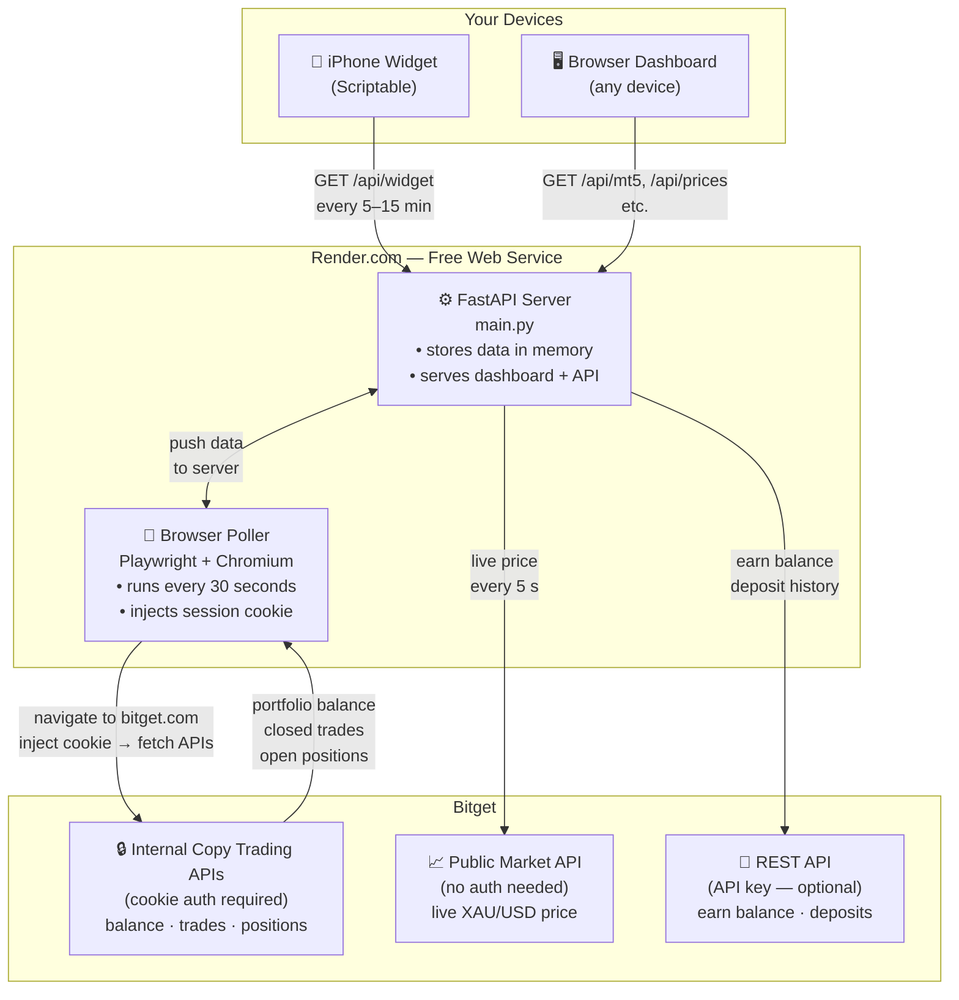

# Bitget Copy Trading Tracker

A self-hosted portfolio dashboard for Bitget MT5 copy trading — tracks your follower account in real time via your session cookie, with a live gold price feed and an iPhone home screen widget.

---

## How it works



**Key points:**
- No Bitget API key required for core tracking — it works via your browser session cookie
- The cookie has a ~5 day TTL; paste a fresh one when the dashboard shows stale data
- The public price feed (XAU/USD) stays live even when your cookie expires, so open position PnL is always current
- Render's free tier sleeps after 15 min of inactivity — use UptimeRobot to keep it awake

---

## Deploy your own instance

### Step 1 — Fork the repo

1. Go to the GitHub repo page
2. Click **Fork → Create fork**
3. You now have your own copy at `github.com/YOUR_USERNAME/bitget-tracker`

---

### Step 2 — Find your Portfolio IDs

Each copy-trading portfolio on Bitget has a unique ID tied to your account. You need these to configure the tracker.

**How to find them:**

1. Log in to [bitget.com](https://bitget.com) in Chrome
2. Go to **Copy Trading → My Copies**
3. Open DevTools (F12) → **Network** tab → filter by **Fetch/XHR**
4. Refresh the page
5. Look for a request named **`getFollowPortfolios`**
6. Click it → **Response** tab → find `portfolioId` under each copy entry

You'll see something like:
```json
{
  "data": {
    "portfolioDetails": [
      { "portfolioId": "1443199880395776000", "pnl": "312.99" },
      { "portfolioId": "1433276980578508800", "pnl": "-65.90" }
    ]
  }
}
```

Note down each `portfolioId` and the name of the trader you're copying.

---

### Step 3 — Deploy to Render

1. Go to [render.com](https://render.com) and sign up (free)
2. Click **New → Web Service**
3. Connect your GitHub account → select your forked repo
4. Render detects `render.yaml` automatically — it configures a Docker deployment on the free tier
5. Under **Environment Variables**, add:

| Variable | Value | Required |
|----------|-------|----------|
| `TRADERS` | `TraderName:portfolioId` | **Yes** |
| `POLL_INTERVAL_SEC` | `30` | No (default: 30 s) |
| `BITGET_API_KEY` | your Bitget API key | No (earn/deposits only) |
| `BITGET_API_SECRET` | your Bitget API secret | No |
| `BITGET_API_PASSPHRASE` | your Bitget passphrase | No |

**`TRADERS` format:**
```
# Single trader
TRADERS=DKTrading:1443199880395776000

# Multiple traders (comma-separated)
TRADERS=DKTrading:1443199880395776000,XauKingScalp:1433276980578508800

# Futures copy trader (add :futures)
TRADERS=FutureTrader:1427930164156649472:futures
```

6. Click **Deploy** — first build takes ~3 minutes (installs Chromium)
7. Your dashboard is live at `https://YOUR-SERVICE-NAME.onrender.com`

---

### Step 4 — Paste your Bitget session cookie

1. Log in to [bitget.com](https://bitget.com) in Chrome
2. Open DevTools (F12) → **Console** tab
3. Run: `copy(document.cookie)`  ← this copies the cookie to your clipboard
4. Open your dashboard → scroll to **Polling Setup**
5. Paste the cookie string → **Save**

The poller starts on the next 30-second cycle. You'll see live data within ~1 minute.

> **Cookie TTL:** The `bt_newsessionid` JWT expires after ~5 days. When `/api/poller` shows `auth_ok: false`, repeat this step to refresh it.

---

### Step 5 — Keep it awake (UptimeRobot)

Render's free tier puts your service to sleep after 15 minutes with no traffic.

1. Sign up at [uptimerobot.com](https://uptimerobot.com) (free)
2. **New Monitor → HTTP(s)**
3. URL: `https://YOUR-SERVICE-NAME.onrender.com/api/poller`
4. Interval: **every 5 minutes**

---

### Step 6 — iPhone widget (optional)

1. Install **Scriptable** from the App Store (free)
2. Open Scriptable → tap **+** → paste the entire contents of `scriptable/widget.js`
3. Edit line 1 of the script — set the URL to your Render service:
   ```js
   const SERVER = "https://YOUR-SERVICE-NAME.onrender.com";
   ```
4. Name the script (e.g. "Bitget") → tap **Run** to test
5. Long-press home screen → **+** → search **Scriptable** → choose **Medium** widget
6. Long-press the widget → **Edit Widget** → set Script to "Bitget"

The widget auto-refreshes every 5–15 minutes in the background.

---

## Optional: Bitget API keys (earn + deposit tracking)

Without API keys the tracker still shows all copy trading data. API keys add:
- **Earn balance** (flexible savings) shown as a separate card
- **Deposit/withdrawal history** for net investment tracking

To create API keys:
1. Bitget → Avatar → **API Management → Create API**
2. Permissions: **Read Only** — enable Spot + Futures read
3. IP whitelist: `0.0.0.0/0` (open) or your Render outbound IP
4. Add `BITGET_API_KEY`, `BITGET_API_SECRET`, `BITGET_API_PASSPHRASE` to Render env vars

---

## Dashboard reference

| URL | Description |
|-----|-------------|
| `/` | Main dashboard |
| `/api/poller` | Scraper status — `auth_ok`, last poll, cookie health |
| `/api/mt5` | Portfolio summary (JSON) |
| `/api/mt5/debug` | Raw cached data — useful for diagnosing field names |
| `/api/prices` | Live XAU/USD price (public, no auth) |

---

## Troubleshooting

| Symptom | Fix |
|---------|-----|
| Dashboard shows "—" everywhere | Check `/api/poller` — if `has_cookie: false`, paste your cookie first |
| `auth_ok: false` in poller | Cookie expired — re-paste a fresh one from Chrome DevTools |
| "No open positions" when trades are active | Wait one poll cycle (up to ~60s); position endpoint is probed early in each cycle |
| Stopped trader still in cards | Refresh dashboard — next poll moves them to Stopped Copies automatically |
| Widget shows "⚠ stale" | Server woke from sleep — pull to refresh; widget catches up next cycle |
| Render build fails | Ensure `Dockerfile` and `render.yaml` are in the root of your fork |
